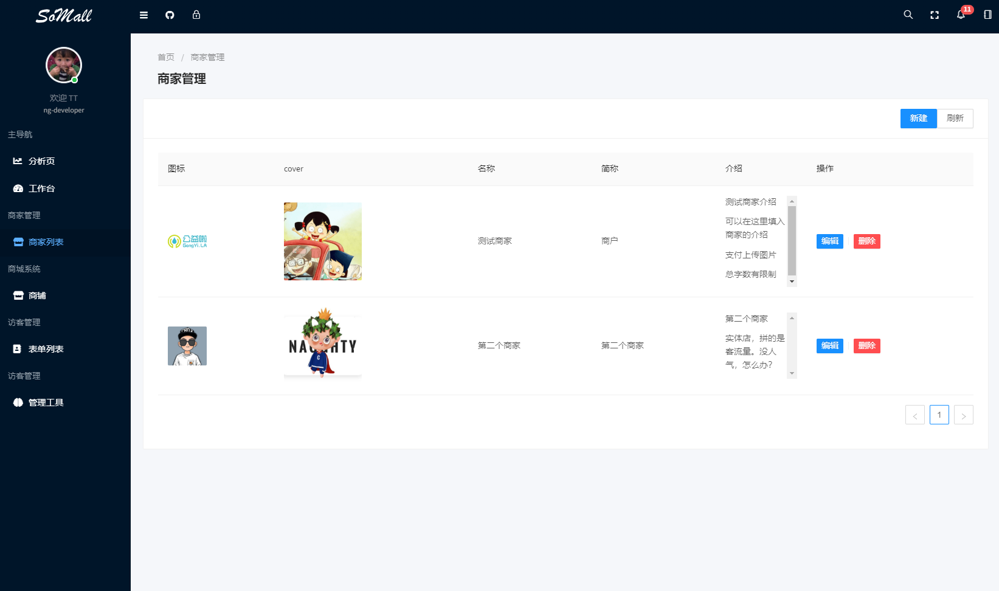
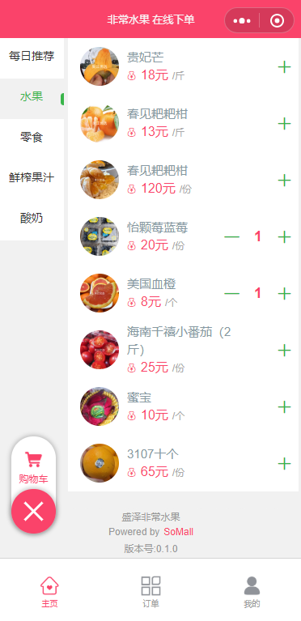
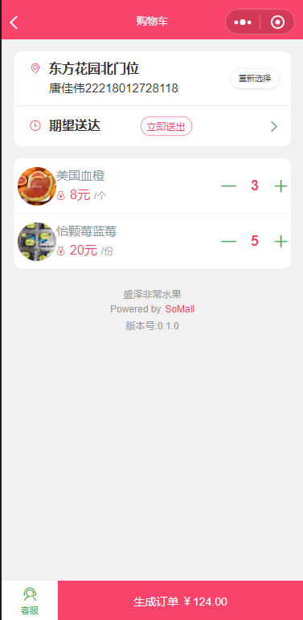
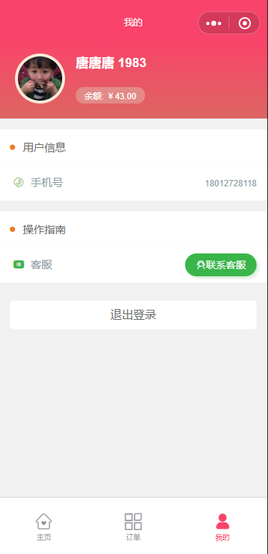
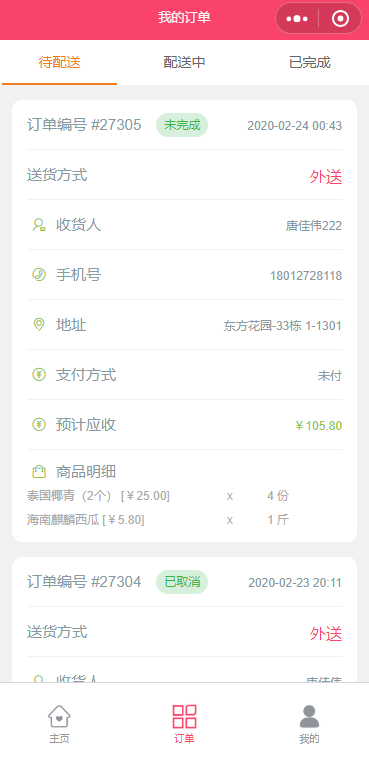
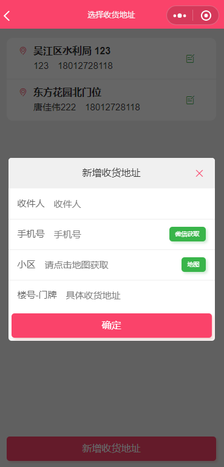

# SoMall

**预计三月底可以上DEMO站**

**一个社交( Socail)+商城(Mall) 的开源学习项目**

**后端采用 abp二代 模块化开发**

**管理后台Angular9 - Ant Design**

#### 技术栈:

.netcore 3.1
vue
uni-app
typescript
docker
mssql

#### 前端

Angular9 - Ant Design
ng-zorro-antd
ng-alain

#### 小程序 
uni-app typescript

#### 后端+微服务技术栈

RabbitMQ (Event Bus)
Redis
Ocelot (Api Gate)
Consul (Service Discovery)
Quartz (background Job Schedule)

## 生鲜电商版小程序截图

