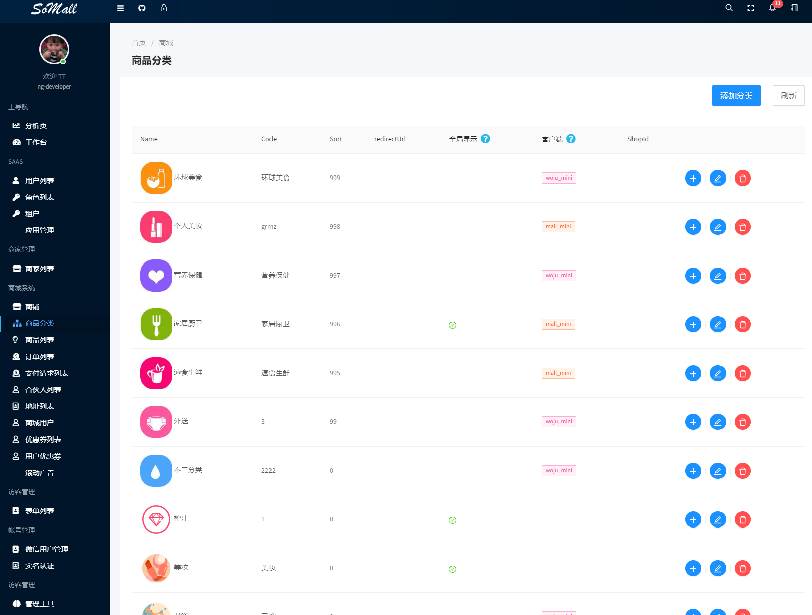
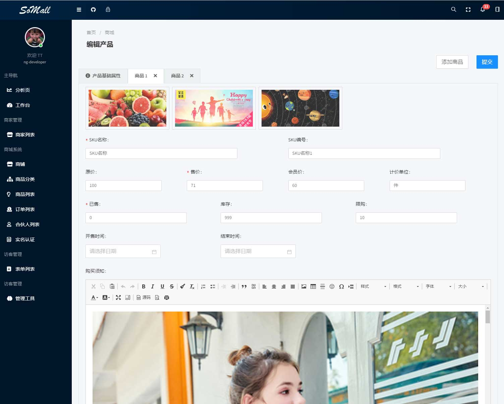
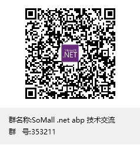

# SoMall 多租户多商户多应用开源平台

**一个社交( Socail)+商城(Mall) 的开源学习项目**

**后端采用 abp二代 模块化开发**

**商城小程序+H5(页面比较多,第一个DEMO应该是小程序和后台一起上了)**

**管理后台Angular9 - Ant Design**

#### 技术栈:

.netcore 3.1
vue
uni-app
typescript
docker
mssql

#### 前端

Angular9 - Ant Design
ng-zorro-antd
ng-alain

#### 小程序 
uni-app typescript

#### 后端+微服务技术栈

RabbitMQ (Event Bus)
Redis
Ocelot (Api Gate)
Consul (Service Discovery)
Quartz (background Job Schedule)

想运行项目首选要熟悉
ids4
abp.vnext
文档:
https://docs.abp.io/en/abp/latest/
somall相关视频
https://space.bilibili.com/486919427/

#### 交流QQ群353211
